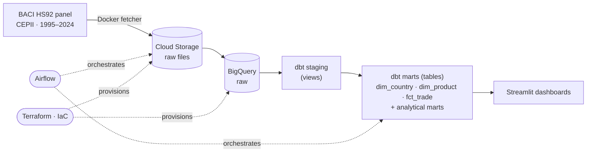

# Global Trade Flow ELT Pipeline

End-to-end data pipeline that turns 30 years of raw bilateral trade records into a
tested, queryable model of world trade — ingestion through dashboards.

## Overview

Models global merchandise trade (1995–2024) so questions like *what does the world
trade most, which countries run the largest surpluses and deficits, and in which
commodities* can be answered against governed, tested marts instead of a raw
~270M-row table. Built to own every stage: ingestion, warehousing, transformation,
testing, orchestration, and a dashboard layer.

## Data

[BACI](https://www.cepii.fr/CEPII/en/bdd_modele/bdd_modele_item.asp?id=37) (CEPII) —
the cleaned, reconciled version of UN Comtrade bilateral trade flows (release V202601).

- Grain: exporter × importer × product (HS6) × year
- Coverage: 1995–2024 (~270M flow records)
- Units: value in thousands USD; quantity in metric tons (partial)

## Stack

| Stage | Tool |
|---|---|
| Ingestion | Python fetcher in Docker → Google Cloud Storage |
| Warehouse | Google BigQuery |
| Transformation | dbt |
| Orchestration | Apache Airflow |
| Infrastructure | Terraform |
| Dashboards | Streamlit |

## Data modeling

dbt is layered **staging → marts**. Staging is one cleaned view per source (light
renames and typing); marts are materialized tables holding conformed dimensions
(`dim_country`, `dim_product`), the bilateral fact (`fct_trade`), and analytical
marts rolled up from it.

| Mart | Grain |
|---|---|
| `mart_trade_by_country_product` | country × product × year |
| `mart_trade_by_country` | country × year |
| `mart_trade_by_product` | product × year |

Data quality is enforced with dbt tests — `not_null`, `relationships`,
`accepted_range`, and `unique_combination_of_columns` on each model's grain.
Messy real-world issues are resolved in-model: reversing UTF-8 mojibake in country
names, and handling country codes reused across border changes (Belgium/Luxembourg,
West Germany, Sudan/South Sudan).

## Dashboards

Streamlit app; all aggregation lives in SQL against the marts, so the pages only set
controls and render.

- **Country Trade Balance** — a country's largest trade surpluses and deficits
- **Commodity Trade Balance** — a country's commodities ranked by net balance
- **Top Traded Products** — most-traded commodities worldwide, with trend over time

Run locally: 

## Roadmap

- Quantities and unit values (price per metric ton)
- Price-penalty analysis — where exporters sell the same commodity for systematically less *(refine once built)*

## Notes

Raw data lives in Cloud Storage, not in this repo. Credentials (service-account key,
dbt profiles) are gitignored and never committed.

## Attribution

Trade data © CEPII (BACI), used under CEPII's terms. Code is released under the [MIT License](LICENSE).